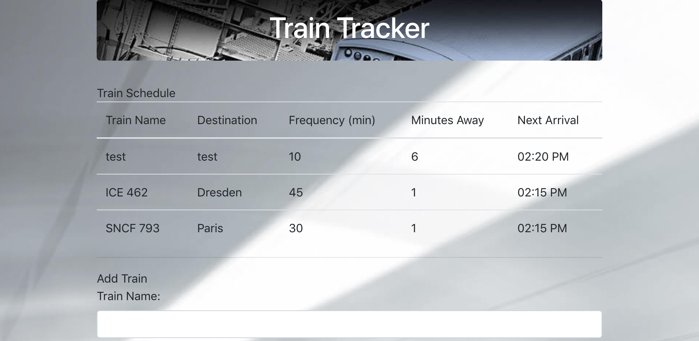

# Train Tracker

**Purpose:** Create a train schedule app. Using firebase to host arrival and departure data. And Moment.js to retrieve and manipulate the data. App will display arrival times and how many minutes remain till arrival.

**Link:** https://carlocabrera.github.io/train-schedule/

**Screenshot:**

